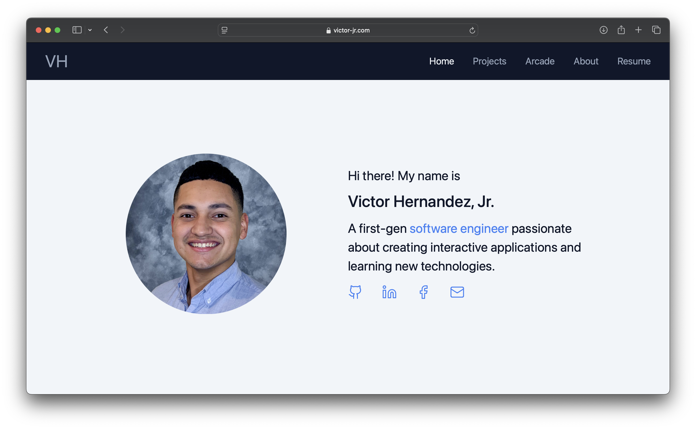
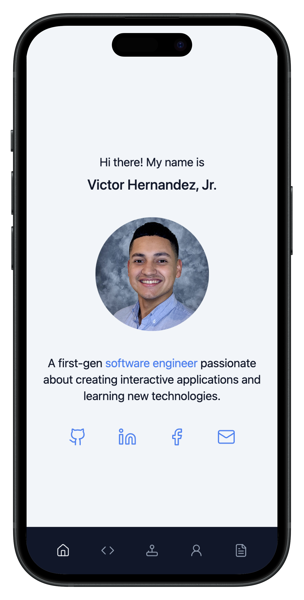

# My Website Portfolio
> [!NOTE]
> Last updated January 14, 2026

## Summary
Hello World! 

My website is a great place to check out projects that I've worked on that have enhanced my web development skills. You could even spend some time playing games in my virtual arcade! 

Feel free to reach out if you'd love to collab on a future project!

## Live Demo
I would appreciate any feedback you might have about my [website](https://vichdz97.github.io/). (:

## Technologies
- [Angular](https://angular.dev) (*v15.2.0*)
- [Devicon](https://devicon.dev) (*v2.17.0*)
- [EmailJS](https://www.emailjs.com) (*v3.11.0*)
- [Lucide Angular](https://lucide.dev/guide/packages/lucide-angular) (*v0.471.0*)
- [Tailwind CSS](https://tailwindcss.com) (*v3.4.17*)
- [TypeScript](https://www.typescriptlang.org) (*v4.9.4*)

## Screenshots
### Desktop View

### Mobile View

